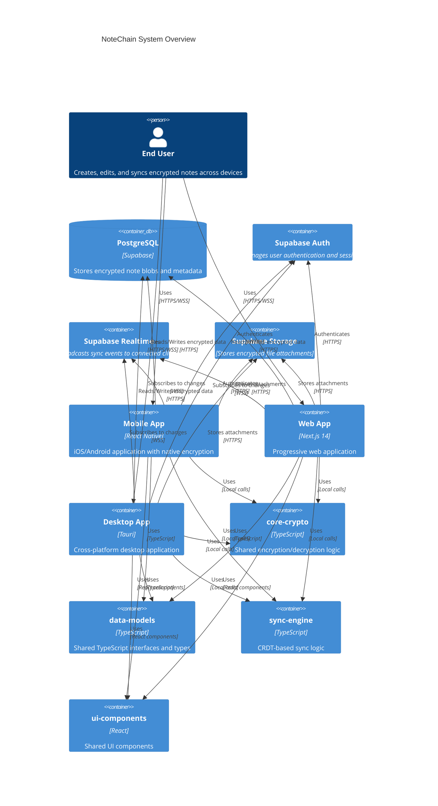
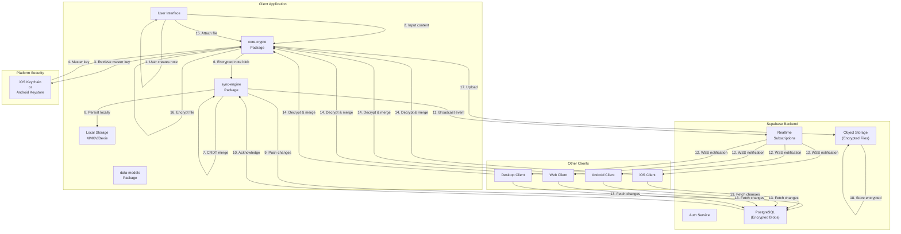
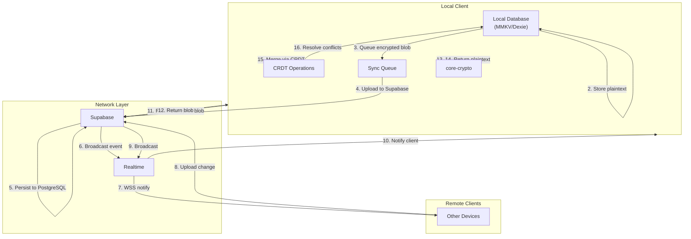
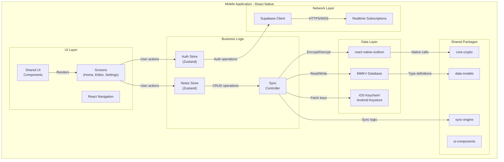
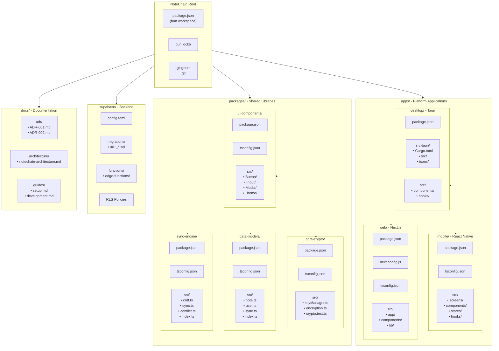
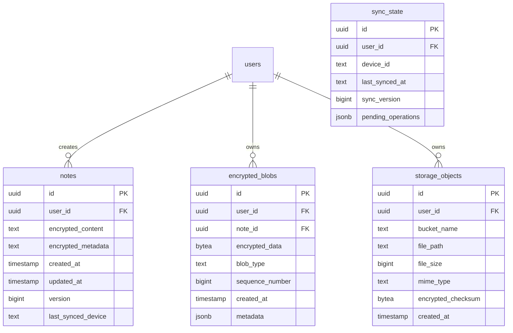
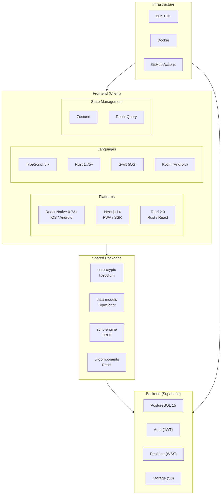
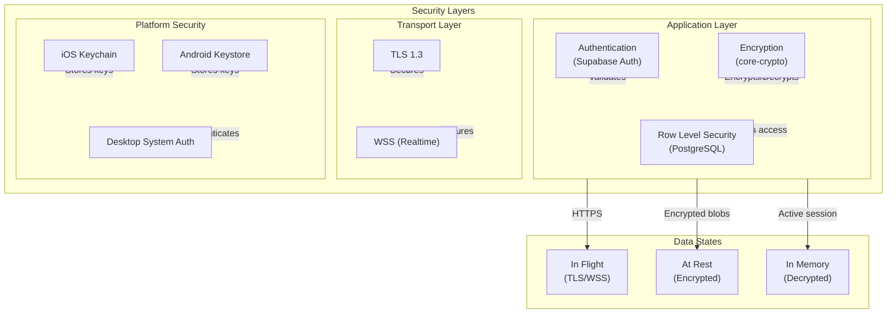
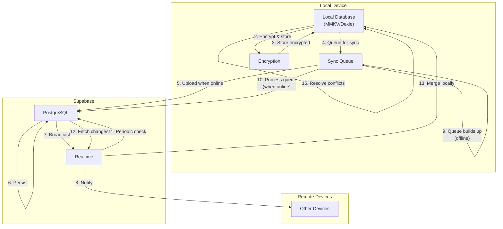

# NoteChain Architecture Diagrams

This document contains comprehensive architecture diagrams for the NoteChain system, visualizing the data flow, platform components, and monorepo structure as defined in ADR-001 and ADR-002.

## 1. System Overview (C4 Container Diagram)



## 2. Data Flow Diagram (Note Creation & Sync)



## 3. Encryption Data Flow

```mermaid
flowchart LR
    subgraph Encryption["Encryption Flow"]
        subgraph Input["Plaintext Input"]
            Note["Note Content"]
            Attach["File Attachment"]
            Meta["Metadata"]
        end

        subgraph Keys["Key Management"]
            MK["Master Key\n(stored in\nPlatform Security)"]
            DEK["Data Encryption Key\n(derived from\nmaster key)"]
        }

        subgraph Output["Encrypted Output"]
            EncNote["Encrypted Note\nBlob"]
            EncFile["Encrypted\nAttachment"]
            EncMeta["Encrypted\nMetadata"]
        end
    end

    Note -- "1. Encrypt with DEK\n(AES-256-GCM)" --> EncNote
    Attach -- "2. Encrypt with DEK\n(AES-256-GCM)" --> EncFile
    Meta -- "3. Encrypt with DEK\n(AES-256-GCM)" --> EncMeta

    MK -- "4. Key derivation\n(PBKKDF2)" --> DEK
    DEK -- "5. Encrypt data" --> Note
    DEK -- "5. Encrypt data" --> Attach
    DEK -- "5. Encrypt data" --> Meta
```

```mermaid
flowchart LR
    subgraph Decryption["Decryption Flow"]
        subgraph Input["Encrypted Input"]
            EncNote["Encrypted Note\nBlob"]
            EncFile["Encrypted\nAttachment"]
        end

        subgraph Keys["Key Management"]
            MK["Master Key\n(retrieved from\nPlatform Security)"]
            DEK["Data Encryption Key\n(re-derived from\nmaster key)"]
        }

        subgraph Output["Plaintext Output"]
            Note["Note Content"]
            Attach["File Attachment"]
        end
    end

    EncNote -- "1. Retrieve encrypted blob" --> EncNote
    EncFile -- "1. Retrieve encrypted file" --> EncFile

    MK -- "2. Fetch from\nKeychain/Keystore" --> MK
    MK -- "3. Key derivation\n(PBKKDF2)" --> DEK

    DEK -- "4. Decrypt with DEK\n(AES-256-GCM)" --> Note
    DEK -- "4. Decrypt with DEK\n(AES-256-GCM)" --> Attach
```

## 4. Sync Engine Data Flow



## 5. Platform-Specific Architecture

### 5.1 Mobile App (React Native)



### 5.2 Web App (Next.js 14)

```mermaid
flowchart TD
    subgraph Web["Web Application - Next.js 14"]
        subgraph UI_Layer["UI Layer"]
            Pages["Pages\n(Route Handlers)"]
            Components["Shared UI\nComponents"]
            PWA["PWA Service\nWorkers"]
        end

        subgraph Business["Business Logic"]
            AuthContext["Auth Context"]
            NotesContext["Notes Context"]
            SyncHook["useSync Hook"]
        end

        subgraph Data["Data Layer"]
            IndexedDB["Dexie.js\n(IndexedDB)"]
            CryptoLib["libsodium-wrappers\n(WASM)"]
            SessionStore["Session Storage"]
        end

        subgraph Shared["Shared Packages"]
            SharedCrypto["core-crypto"]
            SharedModels["data-models"]
            SharedSync["sync-engine"]
            SharedUI["ui-components"]
        end

        subgraph Network["Network Layer"]
            SupabaseClient["Supabase Client"]
            Realtime["Realtime Subscriptions"]
        end

        subgraph SSR["Server Side"]
            SSR["Next.js SSR\n(Auth check)"]
            API["API Routes"]
        end

        Pages -- "User actions" --> AuthContext
        Pages -- "User actions" --> NotesContext
        Components -- "Renders" --> Pages

        AuthContext -- "Auth operations" --> SupabaseClient
        NotesContext -- "CRUD operations" --> SyncHook

        SyncHook -- "Read/Write" --> IndexedDB
        SyncHook -- "Encrypt/Decrypt" --> CryptoLib

        CryptoLib -- "WebAssembly" --> SharedCrypto
        IndexedDB -- "Type definitions" --> SharedModels
        SyncHook -- "Sync logic" --> SharedSync

        SupabaseClient -- "HTTPS/WSS" --> Realtime

        SSR -- "Initial render" --> Pages
        API -- "Backend logic" --> SupabaseClient
```

### 5.3 Desktop App (Tauri 2.0)

```mermaid
flowchart TD
    subgraph Desktop["Desktop Application - Tauri 2.0"]
        subgraph Frontend["Frontend (React)"]
            Screens["React Screens"]
            Components["Shared UI\nComponents"]
        end

        subgraph Bridge["Tauri Bridge"]
            Commands["Tauri Commands"]
            Events["Tauri Events"]
        end

        subgraph Backend["Backend (Rust)"]
            CryptoRust["Rust Crypto\n(libsodium)"]
            StoreRust["Rust Storage"]
            SyncRust["Rust Sync Logic"]
        end

        subgraph Shared["Shared Packages"]
            SharedModels["data-models"]
            SharedSync["sync-engine"]
            SharedUI["ui-components"]
        end

        subgraph Network["Network Layer"]
            SupabaseClient["Supabase Client"]
            Realtime["Realtime Subscriptions"]
        end

        Screens -- "User actions" --> Commands
        Components -- "Renders" --> Screens

        Commands -- "IPC calls" --> Bridge
        Bridge -- "Rust FFI" --> CryptoRust
        Bridge -- "Rust FFI" --> StoreRust
        Bridge -- "Rust FFI" --> SyncRust

        CryptoRust -- "Encrypt/Decrypt" --> StoreRust
        StoreRust -- "Persist" --> LocalStorage["Local Storage"]

        SyncRust -- "Sync logic" --> SupabaseClient
        SupabaseClient -- "HTTPS/WSS" --> Realtime

        StoreRust -- "Type definitions" --> SharedModels
        SyncRust -- "Sync logic" --> SharedSync

        Events -- "Notify frontend" --> Bridge
```

## 6. Monorepo Structure



## 7. Database Schema (Supabase)



## 8. Technology Stack Summary



## 9. Security Architecture



## 10. Offline-First Sync Flow



---

## Diagram Legend

| Symbol          | Meaning                       |
| --------------- | ----------------------------- |
| Rectangular box | Component, service, or module |
| Cylinder        | Database or storage           |
| Parallelogram   | External service or API       |
| Arrows          | Data flow direction           |
| Dotted line     | Optional or conditional flow  |
| Shaded region   | System boundary or layer      |

## Revision History

| Version | Date       | Description                                                |
| ------- | ---------- | ---------------------------------------------------------- |
| 1.0     | 2025-01-19 | Initial architecture diagrams based on ADR-001 and ADR-002 |

## References

- [ADR-001: Technology Stack Selection](../adr/ADR-001-technology-stack.md)
- [ADR-002: React Native Framework Choice](../adr/ADR-002-framework-choice.md)
- [Technical Specifications](../../specs/Specs-Technical-Specifications.md)
